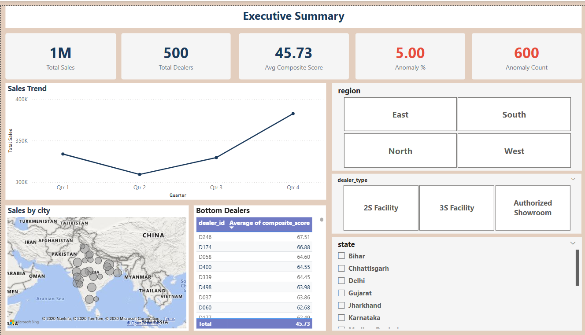
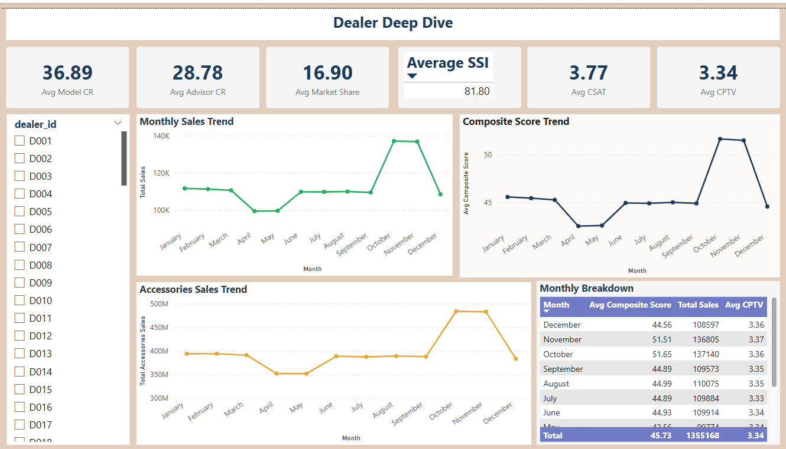
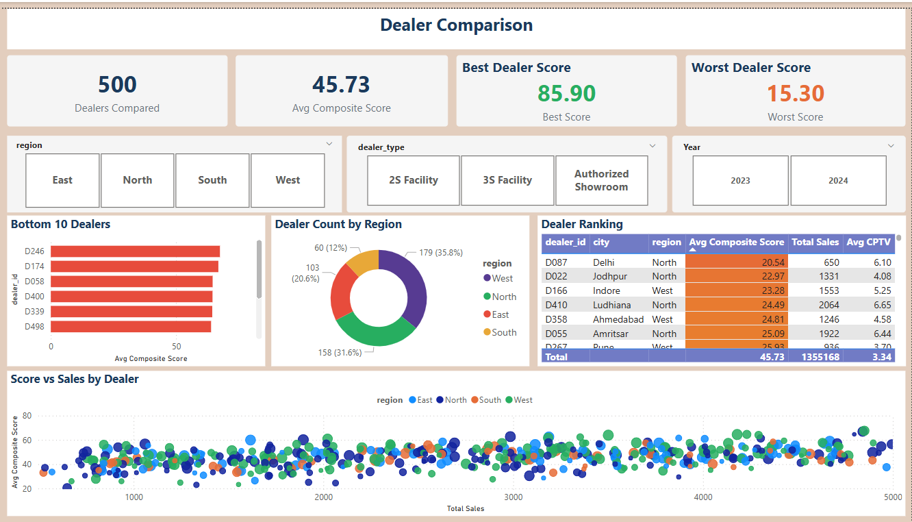
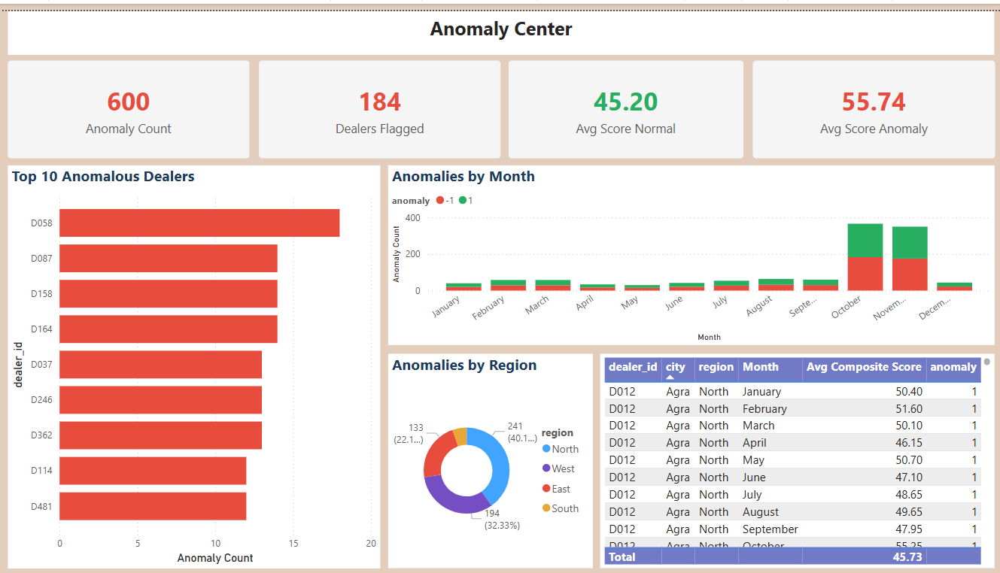
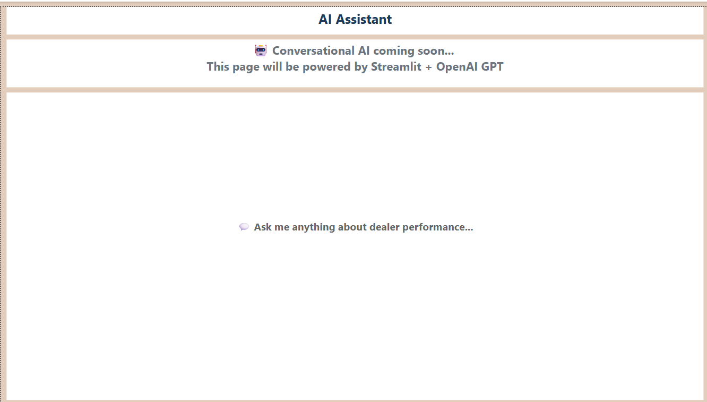
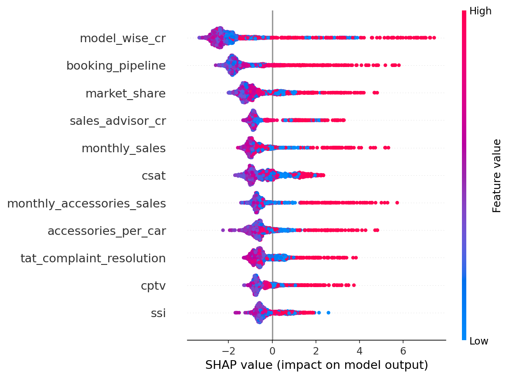

# Dealer Performance Intelligence System

AI-powered dealer performance monitoring system with Gen AI conversational analytics. Built for automobile dealership networks.

## Overview
Monitors 500 dealers across 11 KPIs over 24 months (12,000-row dataset). Detects underperformance, explains causes using XAI, and recommends interventions via counterfactual AI. Includes a Gen AI Dashboard Speaker for natural language queries.

## Features
- 500 dealers × 24 months × 11 KPIs synthetic dataset
- Weighted composite scoring engine
- Anomaly detection (Isolation Forest)
- XAI explainability (SHAP)
- Counterfactual intervention recommendations (DiCE)
- 5-page Power BI dashboard
- Gen AI Dashboard Speaker (Google Gemini)
- Deployed on Streamlit Cloud

## Tech Stack
Python | Pandas | NumPy | Scikit-learn | XGBoost | SHAP | DiCE | Power BI | Streamlit | Plotly | Google Gemini

## Dashboard Pages
1. **Executive Summary** — High-level KPIs, sales trends, bottom 10 dealers
2. **Dealer Deep Dive** — Single dealer view, 11 KPI trends
3. **Dealer Comparison** — Regional filter, scatter plot, ranking table
4. **Anomaly Center** — Flagged dealers, anomaly trends by month & region
5. **AI Assistant** — Natural language Q&A with Dashboard Speaker

## Screenshots

### Page 1: Executive Summary

### Page 2: Dealer Deep Dive

### Page 3: Dealer Comparison

### Page 4: Anomaly Center

### Page 5: AI Assistant

### SHAP Explainability

## Live Demo
[View App](https://dealer-performance-ai-wppcvadb4ixigqwv6fkcoz.streamlit.app/)

## Folder Structure
├── 01_Raw_Data/ # Original CSVs
├── 02_Excel_Outputs/ # Scored datasets, counterfactuals
├── 03_Python_Scripts/ # Data generation, ML, XAI, counterfactuals
├── 04_PowerBI/ # Dashboard .pbix + screenshots
├── 05_Streamlit_App/ # App files
├── 06_Documentation/ # Data dictionary, methodology
└── README.md

## How to Run Locally
1. Clone repository
2. Install dependencies: `pip install -r requirements.txt`
3. Run app: `streamlit run app.py`

## Author
Asawari Vasantrao Fuse
2nd Year, CSE (Data Science)
